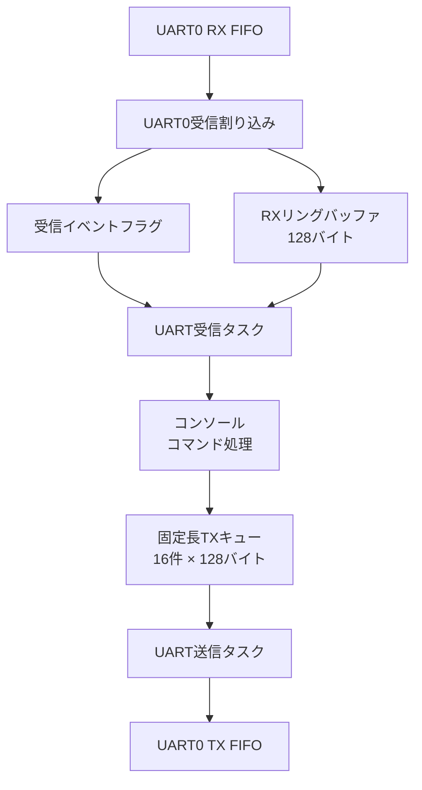

# TryKernel for Raspberry Pi Pico

Raspberry Pi Pico（RP2040）上で動作する、学習用の小規模RTOSプロジェクトです。

CQ出版社『Interface』2023年7月号の特集「ラズパイPicoで1500行 ゼロから作るOS」に掲載された、シングルコア版の**Try Kernel**を基にしています。

掲載版へGPIOドライバ、UARTコンソール、UART送受信バッファ、UART受信割り込み、タスク間同期などを追加し、RTOSとマイコンの内部動作を学習するために拡張しています。

Pico SDKは使用せず、RP2040のレジスタを直接操作しています。

> [!NOTE]
> 本プロジェクトは、OSとマイコンの学習を目的としています。  
> 製品への組み込みを目的としたものではありません。

## プロジェクトの目的

このプロジェクトでは、次の仕組みを実際に実装・動作確認しながら理解することを目的としています。

- タスクの生成と実行
- 優先度ベースのスケジューリング
- コンテキスト切り替え
- READYキューとWAITキュー
- セマフォによる排他制御
- イベントフラグによるタスク同期
- UART受信割り込み
- 割り込み処理からタスク処理への受け渡し
- UART送受信バッファ
- UARTコンソールとコマンド処理

## 主な機能

### TryKernel

- Cortex-M0+向けシングルコアRTOS
- 優先度ベースのプリエンプティブ・スケジューリング
- タスク生成・起動・終了
- タスク遅延
- タスク起床待ち・起床
- セマフォ
- イベントフラグ
- タスク付帯同期
- 割り込み・例外コンテキストの判定
- SysTickによる10ms周期の時間管理
- 最大32タスク
- タスク優先度1～16
- 最大8セマフォ
- 最大8イベントフラグ

### 追加した周辺機能

- GPIO25のオンボードLED制御
- UART0のレジスタレベル・ドライバ
- UART0受信割り込み
- 128バイトのUART受信リングバッファ
- イベントフラグによるUART受信タスクの起床
- UART受信ソフトウェア・オーバーフロー検出
- UART RX FIFOハードウェア・オーバーラン検出
- 1行入力方式のUARTコンソール
- コマンドテーブル方式のコマンド処理
- 固定長UART送信キュー
- UART送信専用タスク
- セマフォによる送信キューの保護
- イベントフラグによる送信タスクの起床
- 軽量な`mini_printf()`

## UARTの構成



UARTの受信処理と送信処理は、それぞれ異なる方式で実装しています。

| 方向 | 方式 |
|---|---|
| UART受信 | 割り込み＋リングバッファ＋イベントフラグ |
| UART送信 | 送信キュー＋専用送信タスク＋ポーリング出力 |

## UART受信処理

UART受信処理は、次の流れで動作します。

```text
UART0で文字を受信
        ↓
UART0受信割り込み発生
        ↓
ハードウェアFIFOから受信データを読み出す
        ↓
ソフトウェア・リングバッファへ格納
        ↓
コールバック関数を呼び出す
        ↓
tk_set_flg()で受信イベントをセット
        ↓
UART受信タスクが待ち状態から起床
        ↓
リングバッファが空になるまでデータを処理
        ↓
再びイベント待ち状態へ移行
```

UART割り込みハンドラでは、コンソールのコマンド解析を行いません。

割り込みハンドラの役割は、次の処理に限定しています。

- UART RX FIFOからのデータ読み出し
- 受信リングバッファへの格納
- オーバーラン状態の確認
- 受信タスクへのイベント通知

文字列のエコーやコマンド解析は、UART受信タスク側で実行します。

### 受信通知コールバック

UARTドライバがイベントフラグIDを直接管理しないように、受信通知にはコールバック関数を使用しています。

```c
typedef void (*UART_RX_NOTIFY_FUNC)(void);

void uart_rx_set_notify(UART_RX_NOTIFY_FUNC notify);
```

UART割り込みハンドラは、1文字以上をリングバッファへ格納できた場合に、登録された通知関数を呼び出します。

```c
if ((received != FALSE) && (uart_rx_notify != NULL)) {
    uart_rx_notify();
}
```

受信タスク側のコールバック関数では、イベントフラグをセットします。

```c
static void uart_rx_notify_from_isr(void)
{
    if (uart_rx_flgid > 0) {
        (void)tk_set_flg(
            uart_rx_flgid,
            UART_RX_EVENT_DATA
        );
    }
}
```

### UART受信タスク

UART受信タスクは、イベントフラグを無期限で待ちます。

```c
err = tk_wai_flg(
    uart_rx_flgid,
    UART_RX_EVENT_DATA,
    TWF_ORW | TWF_BITCLR,
    &flgptn,
    TMO_FEVR
);
```

受信イベントが発生すると、リングバッファが空になるまでデータを取り出します。

```c
while (uart_rx_getc(&c)) {
    console_input_char(c);
}
```

従来の2ms周期ポーリングで使用していた、次の処理は削除しました。

```c
tk_dly_tsk(2);
```

受信データがない間、UART受信タスクはWAIT状態になります。

```text
state  = TS_WAIT
waifct = TWFCT_FLG
```

### 割り込みからのタスク起床

UART割り込み内で`tk_set_flg()`を実行すると、待っているUART受信タスクがREADY状態になります。

TryKernelの現在の実装では、`dispatch()`によってPendSVが保留されます。UART割り込み中に直接コンテキストを切り替えるのではなく、UART割り込みから復帰した後にタスク切り替えが実行されます。

## UART送信処理

通常の文字列出力では、次の関数を使用します。

```c
uart_tx_send("Hello Try Kernel\r\n");
```

書式付き出力には、次の関数を使用します。

```c
uart_tx_printf(
    "count=%u value=%x\r\n",
    count,
    value
);
```

送信要求は固定長キューへ登録されます。

イベントフラグによってUART送信タスクが起床し、UART送信タスクがキューから文字列を取り出してUART0へ出力します。

```text
各タスク
   ↓
uart_tx_send() / uart_tx_printf()
   ↓
固定長UART送信キュー
   ↓
イベントフラグ
   ↓
UART送信タスク
   ↓
UART0 TX FIFO
```

送信キューはセマフォで保護しています。

また、コンソールの入力エコーなどによる直接出力と、UART送信タスクによる出力が競合しないよう、実際のUART出力にも別のセマフォを使用しています。

### `mini_printf()`の対応書式

現在、次の書式に対応しています。

```text
%s  %c  %d  %u  %x  %%
```

浮動小数点数、桁数指定、ゼロ埋めなどには対応していません。

## UART設定と接続

| 項目 | 設定 |
|---|---|
| UART | UART0 |
| ボーレート | 115200bps |
| データ形式 | 8N1 |
| フロー制御 | なし |
| TX | GPIO0 |
| RX | GPIO1 |
| LED | GPIO25 |

USB-UART変換器またはRaspberry Pi Debug ProbeのUART端子を使用する場合は、次のように接続します。

| Raspberry Pi Pico | USB-UART側 |
|---|---|
| GPIO0（TX） | RX |
| GPIO1（RX） | TX |
| GND | GND |

信号レベルは3.3V TTLを使用してください。

## 必要な環境

Linux MintまたはUbuntu系Linuxを想定しています。

- Raspberry Pi Pico
- Raspberry Pi Debug ProbeなどのCMSIS-DAP対応デバッガ
- GNU Arm Embedded Toolchain
- GNU Make
- OpenOCD
- minicomなどのシリアル端末

Ubuntu／Linux Mintでは、必要なツールを次のようにインストールできます。

```bash
sudo apt update
sudo apt install gcc-arm-none-eabi binutils-arm-none-eabi make openocd minicom
```

## リポジトリの取得

```bash
git clone https://github.com/kazu025/trykernel-rp2040-console.git
cd trykernel-rp2040-console
```

## ビルド

リポジトリのルートディレクトリで実行します。

```bash
make clean
make
```

ビルドに成功すると、`build/`以下に次のファイルが生成されます。

| ファイル | 内容 |
|---|---|
| `tkv.elf` | デバッグ情報付き実行ファイル |
| `tkv.bin` | バイナリ形式 |
| `tkv.hex` | Intel HEX形式 |
| `tkv.lst` | ソース混在の逆アセンブル・リスト |
| `tkv.map` | リンカ・マップ |

このプロジェクトは、次のオプションを使用するフリースタンディング環境です。

```text
-ffreestanding
-nostdlib
-nostartfiles
-fno-builtin
```

標準Cライブラリは使用していません。

`uart_tx_init()`では構造体の各メンバを明示的に初期化し、コンパイラによって意図しない`memset()`呼び出しが生成され、リンクエラーになる問題を回避しています。

## 書き込み

PicoのSWD端子とCMSIS-DAP対応デバッガを接続して、次を実行します。

```bash
make flash
```

書き込み後にCPUを停止させる場合は、次を使用します。

```bash
make flash-halt
```

OpenOCDからCPUを停止する場合は、次を使用します。

```bash
make halt
```

## UARTコンソール

UARTが`/dev/ttyACM0`として認識された場合は、次のように接続します。

```bash
minicom -D /dev/ttyACM0 -b 115200
```

端末側を次のように設定します。

- 115200bps
- 8ビット
- パリティなし
- ストップビット1
- ハードウェア・フロー制御なし
- ソフトウェア・フロー制御なし

現在のコンソールは、CRをEnterとして処理します。端末の改行送信もCRに設定してください。

## コマンド一覧

| コマンド | 内容 |
|---|---|
| `help` / `h` | コマンド一覧を表示 |
| `status` | TryKernel、LED、UARTの状態を表示 |
| `echo <text>` | 引数をUARTへ出力 |
| `led on` | LEDを点灯 |
| `led off` | LEDを消灯 |
| `led blink` | LEDを点滅 |
| `print` | `mini_printf()`の書式テスト |

## 動作例

```text
Start Try Kernel

uart tx task start
Hello Try Kernel

uart rx task start
> LED task start!!
help
commands:
   help -  show command list
   h -  show command list
   status -  show system status
   echo -  echo arguments
   led -  led on/off/blink
   print -  print test
> status
TryKernel status: running
LED mode: OFF
UART TX queue: OK
UART TX overflow count: 0
UART RX overflow count: 0
UART RX HW overrun count: 0
> led blink
led blink
> echo abcdef
abcdef
> print
test: abc Z -123 456 1a2b3c %
```

起動時に次のように表示される場合があります。

```text
> LED task start!!
```

これは、UART受信タスクがプロンプトを表示した後に、LEDタスクの起動メッセージが送信キューへ登録されたためです。UART出力が文字単位で混在しているわけではありません。

## タスク構成

数字が小さいほど優先度が高くなります。

| タスク | 優先度 | 役割 |
|---|---:|---|
| UART RX | 4 | イベント待ち、リングバッファ読み出し、コンソール入力 |
| UART TX | 6 | 送信キューの取り出しとUART出力 |
| UART Log A | 8 | 送信競合テスト用ログ |
| UART Log B | 10 | 送信競合テスト用ログ |
| LED | 12 | LEDの点灯・消灯・点滅 |

ログタスクの出力は、`user/task_uartlog.c`の`ENABLE_UART_LOG_TEST`で有効または無効にできます。現在の初期値は無効です。

## ディレクトリ構成

```text
.
├── boot/       # boot2、リセットハンドラ、ベクタテーブル
├── drivers/    # GPIO、UARTドライバ
├── include/    # TryKernel API、型、レジスタ、設定定義
├── kernel/     # スケジューラ、タスク管理、同期機能
├── linker/     # RP2040用リンカスクリプト
├── user/       # ユーザータスク、コンソール、UART送信機能
└── Makefile
```

## UARTエラー情報

`status`コマンドでは、次のUARTエラー情報を確認できます。

| 表示 | 内容 |
|---|---|
| `UART TX overflow count` | 送信キューへ登録できなかった回数 |
| `UART RX overflow count` | 受信リングバッファへ格納できなかった回数 |
| `UART RX HW overrun count` | UART RX FIFOのオーバーランを検出した回数 |

`UART RX HW overrun count`は、オーバーランを検出した回数です。失われた正確な文字数ではありません。

## 実装上の制約

- RP2040のコア0だけを使用するシングルコア構成です。
- UART受信リングバッファの配列サイズは128バイトです。
- UART送信キューは16件です。
- UART送信キューの1メッセージは、終端文字を含めて128バイトです。
- 送信文字列は最大127文字で切り詰められます。
- コンソールの改行入力は、現在CRのみを処理します。
- `mini_printf()`は機能を限定した独自実装です。
- TryKernel APIは学習に必要な範囲の部分実装です。
- T-Kernel仕様への完全準拠を目的としていません。
- 待ちを発生させるTryKernel APIは、割り込み・例外コンテキストから呼び出せません。
- 割り込みからの`tk_set_flg()`は、本プロジェクトのTryKernel実装を前提としています。

## 原典からの変更について

本プロジェクトは、『Interface』2023年7月号に掲載されたRP2040向けシングルコア版TryKernelを基にしています。

学習および動作確認のため、掲載版に対して一部の修正と機能追加を行っています。

本リポジトリは、原著者またはCQ出版社による公式な修正版ではありません。

### TryKernel本体の修正

- `tk_wup_tsk()`のレディキュー添字を修正
- タスクAPIの一部に引数検査を追加
- セマフォAPIの一部に引数検査を追加
- イベントフラグAPIの一部に引数検査を追加
- UART割り込みに必要なNVICとUARTレジスタ定義を追加
- UART受信オーバーラン検出に必要なレジスタ定義を追加
- IPSRによる割り込み・例外コンテキスト判定を追加
- `tk_wai_flg()`、`tk_wai_sem()`、`tk_dly_tsk()`、`tk_slp_tsk()`にコンテキストチェックを追加
- 割り込み・例外コンテキストから待ち系APIを呼び出した場合は`E_CTX`を返すように変更

### ユーザー機能・ドライバの追加

- GPIOドライバとLED制御タスク
- UART0ドライバ
- UART受信割り込み
- UART受信リングバッファ
- コールバックによるUART受信通知
- イベントフラグによるUART受信タスクの起床
- UART送信キューと専用送信タスク
- セマフォによるUART送信キューの排他制御
- イベントフラグによるUART送信タスクの起床
- UARTコンソールとコマンド処理
- UART受信ハードウェア・オーバーランの検出・表示
- 軽量な`mini_printf()`

## UART受信割り込みの実装段階

UART受信処理は、段階的に実装しています。

### 第一段階

UART受信をタスクによるポーリングから、UART0受信割り込みへ変更しました。

```text
UART受信割り込み
    ↓
受信リングバッファ
    ↓
UART受信タスクが周期的に確認
```

### 第二段階

UART受信タスクの周期確認を廃止し、イベントフラグによる起床方式へ変更しました。

```text
UART受信割り込み
    ↓
受信リングバッファ
    ↓
イベントフラグ
    ↓
UART受信タスク起床
```

これにより、受信データがない間の周期ポーリングが不要になりました。


### 第三段階

割り込みからTryKernel APIを安全に使用できるようにするため、Cortex-M0+のIPSR（Interrupt Program Status Register）を使用して、現在の実行コンテキストを判定する処理を追加しました。

```c
static inline UW get_ipsr(void)
{
    UW ipsr;

    __asm__ volatile("mrs %0, ipsr" : "=r"(ipsr));

    return ipsr;
}

static inline BOOL is_interrupt_context(void)
{
    return (get_ipsr() != 0U);
}
```

IPSRには、現在処理している例外番号が格納されます。

```text
IPSR = 0
    → 通常のThread mode

IPSR != 0
    → 例外・割り込みハンドラ実行中
```

RP2040のUART0はIRQ20であるため、UART0割り込み中のException Numberは次の値になります。

```text
16 + IRQ20 = 36 = 0x24
```

GDBを使用して実機で確認した結果、通常のタスク実行中とUART0割り込み中で次の値になりました。

| 停止位置                  |         xPSR |       IPSR | 実行状態        |
| --------------------- | -----------: | ---------: | ----------- |
| `task_uartrx()`       | `0x01000000` |        `0` | Thread mode |
| `uart0_irq_handler()` | `0x61000024` | `36（0x24）` | UART0 IRQ   |

割り込みハンドラにはタスクのようなTCBは存在しません。

そのため、割り込み中に待ちを発生させるAPIを呼び出すと、`cur_task`が指している割り込まれたタスクを誤ってWAIT状態へ移行させる可能性があります。

これを防ぐため、次の待ち系APIにコンテキストチェックを追加しました。

| API            | 処理        |
| -------------- | --------- |
| `tk_wai_flg()` | イベントフラグ待ち |
| `tk_wai_sem()` | セマフォ資源待ち  |
| `tk_dly_tsk()` | タスク遅延     |
| `tk_slp_tsk()` | タスク起床待ち   |

各APIの先頭で実行コンテキストを確認します。

```c
if (is_interrupt_context()) {
    return E_CTX;
}
```

割り込み・例外コンテキストからこれらのAPIが呼ばれた場合は、TCBやREADY／WAITキューを変更せず、`E_CTX (-25)`を返します。

動作確認としてUART0割り込みからテスト用に`tk_wai_flg()`を呼び出し、GDBで次の戻り値を確認しました。

```text
E_CTX = -25
```

一方、UART受信割り込みで使用している`tk_set_flg()`は、待ち状態のUART RXタスクをREADY状態へ移行する通知側のAPIです。

現在のUART受信処理では、引き続き割り込みハンドラから`tk_set_flg()`を使用しています。

```text
UART0 IRQ
    ↓
uart_rx_notify_from_isr()
    ↓
tk_set_flg()
    ↓
UART RX task
WAIT → READY
    ↓
PendSVを保留
    ↓
割り込み復帰後に必要に応じてタスク切り替え
```

## 今後の予定

- CR、LF、CRLFすべてへの対応
- UARTエラー情報と統計表示の拡充
- `tk_set_flg()`、`tk_sig_sem()`、`tk_wup_tsk()`など待ち解除側APIの割り込みコンテキストでの利用条件整理
- UART受信割り込み処理の改善
- GDBを使ったREADYキュー、WAITキュー、タスク状態、例外処理の確認
- TryKernel内部の理解を進めながら、必要な機能を段階的に追加

## 参考資料

- [Interface 2023年7月号「ラズパイPicoで1500行 ゼロから作るOS」](https://interface.cqpub.co.jp/magazine/202307/)
- [RP2040 Datasheet（Raspberry Pi公式）](https://pip.raspberrypi.com/documents/RP-008371-DS-rp2040-datasheet.pdf)

## ライセンスと原典について

本リポジトリは、『Interface』2023年7月号「ラズパイPicoで1500行 ゼロから作るOS」に掲載されたTry Kernelを基に、学習目的で一部を修正し、機能を追加したものです。

```text
Copyright (c) 2023 Yuichi Toyoyama
Copyright (c) 2026 kazu025
```

Try Kernel由来のコードはMIT Licenseに従います。

本リポジトリで追加・変更したコードについても、特に記載がない限りMIT Licenseで公開します。

著作権表示およびライセンスの詳細は、リポジトリ内の`LICENSE`と各ソースファイルのライセンス表示を確認してください。

`boot2.c`など、個別のライセンス表示があるファイルについては、そのファイルに記載されたライセンス条件が適用されます。

本リポジトリは学習目的の非公式な派生版であり、原著者およびCQ出版社による公式な修正版ではありません。