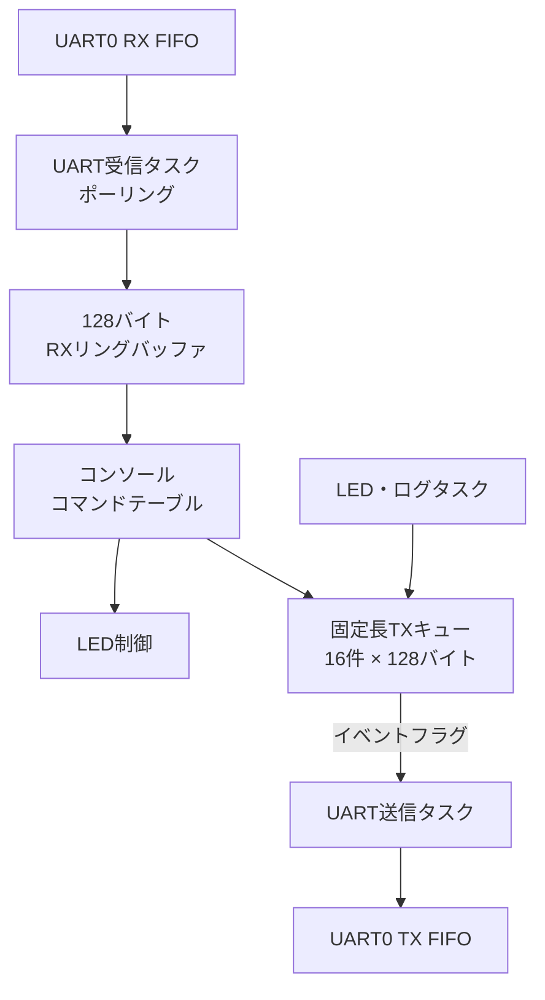

# TryKernel for Raspberry Pi Pico

Raspberry Pi Pico（RP2040）上で動作する、学習用の小規模RTOSプロジェクトです。

CQ出版社『Interface』2023年7月号の特集「ラズパイPicoで1500行 ゼロから作るOS」に掲載されたシングルコア版 **Try Kernel** を基に、GPIOドライバ、UARTコンソール、UART送受信バッファ、タスク間同期などを追加しています。

Pico SDKは使用せず、RP2040のレジスタを直接操作しています。RTOSのスケジューリング、コンテキスト切り替え、待ち行列、セマフォ、イベントフラグなどの仕組みを、実際に動かしながら理解することを目的としています。

> [!NOTE]
> 本プロジェクトはOSとマイコンの学習用です。製品への組み込みを目的としたものではありません。

## 主な機能

### TryKernel

- Cortex-M0+向けシングルコアRTOS
- 優先度ベースのプリエンプティブ・スケジューリング
- タスク生成・起動・終了
- タスク遅延・起床待ち・起床
- セマフォによる排他制御
- イベントフラグによるタスク同期
- SysTickによる10 ms周期の時間管理
- 最大32タスク、優先度1～16
- 最大8セマフォ、最大8イベントフラグ

### 追加した周辺機能

- GPIO25のオンボードLED制御
- UART0のレジスタレベル・ドライバ
- UART受信ポーリングと128バイトのリングバッファ
- UART受信のソフトウェア・オーバーフロー検出
- UART RX FIFOのハードウェア・オーバーラン検出
- 1行入力方式のUARTコンソール
- コマンドテーブル方式のコマンド処理
- 固定長UART送信キュー
- UART送信専用タスク
- セマフォによる送信キューの保護
- イベントフラグによる送信タスクの起床
- 軽量な`mini_printf()`

## UARTの構成



通常の文字列出力では、`uart_tx_send()`または`uart_tx_printf()`を使います。送信要求はキューへ登録され、イベントフラグで起床したUART送信タスクが実際の送信を行います。

送信キューはセマフォで保護しています。また、コンソールの入力エコーなど、UARTへ直接出力する処理と送信タスクが競合しないように、実際のUART出力も別のセマフォで排他制御しています。

## UART設定と接続

| 項目 | 設定 |
|---|---|
| UART | UART0 |
| ボーレート | 115200 bps |
| データ形式 | 8N1 |
| フロー制御 | なし |
| TX | GPIO0 |
| RX | GPIO1 |
| LED | GPIO25 |

USB-UART変換器またはRaspberry Pi Debug ProbeのUART端子を使用する場合は、次のように接続します。

| Raspberry Pi Pico | USB-UART側 |
|---|---|
| GPIO0（TX） | RX |
| GPIO1（RX） | TX |
| GND | GND |

信号レベルは3.3 V TTLを使用してください。

## 必要な環境

Linux MintまたはUbuntu系Linuxを想定しています。

- Raspberry Pi Pico
- Raspberry Pi Debug ProbeなどのCMSIS-DAP対応デバッガ
- GNU Arm Embedded Toolchain
- GNU Make
- OpenOCD
- minicomなどのシリアル端末

Ubuntu／Linux Mintでは、必要なツールを次のようにインストールできます。

```bash
sudo apt update
sudo apt install gcc-arm-none-eabi binutils-arm-none-eabi make openocd minicom
```

## ビルド

リポジトリのルート・ディレクトリで実行します。

```bash
make clean
make
```

ビルドに成功すると、`build/`以下に次のファイルが生成されます。

| ファイル | 内容 |
|---|---|
| `tkv.elf` | デバッグ情報付き実行ファイル |
| `tkv.bin` | バイナリ形式 |
| `tkv.hex` | Intel HEX形式 |
| `tkv.lst` | ソース混在の逆アセンブル・リスト |
| `tkv.map` | リンカ・マップ |

このプロジェクトは`-nostdlib`、`-nostartfiles`を使用するフリースタンディング環境です。`uart_tx_init()`では構造体の各メンバを明示的に代入し、コンパイラが意図せず`memset()`への依存を生成してリンクエラーになる問題を回避しています。

## 書き込み

PicoのSWD端子とCMSIS-DAP対応デバッガを接続して、次を実行します。

```bash
make flash
```

書き込み後に停止させる場合は、次を使用します。

```bash
make flash-halt
```

OpenOCDから単にCPUを停止する場合は、次を使用します。

```bash
make halt
```

## UARTコンソール

例として、UARTが`/dev/ttyACM0`として認識された場合は次のように接続します。

```bash
minicom -D /dev/ttyACM0 -b 115200
```

端末側は115200 bps、8N1、フロー制御なしに設定します。現在のコンソールはCRをEnterとして処理するため、端末の改行送信もCRに設定してください。

### コマンド一覧

| コマンド | 内容 |
|---|---|
| `help` / `h` | コマンド一覧を表示 |
| `status` | TryKernel、LED、UARTの状態を表示 |
| `echo <text>` | 引数をUARTへ出力 |
| `led on` | LEDを点灯 |
| `led off` | LEDを消灯 |
| `led blink` | LEDを点滅 |
| `print` | `mini_printf()`の書式テスト |

`mini_printf()`は、現在次の書式に対応しています。

```text
%s  %c  %d  %u  %x  %%
```

### 動作例

```text
> h
commands:
   help -  show command list
   h -  show command list
   status -  show system status
   echo -  echo arguments
   led -  led on/off/blink
   print -  print test
> status
TryKernel status: running
LED mode: OFF
UART TX queue: OK
UART TX overflow count: 0
UART RX overflow count: 0
UART RX HW overrun count: 0
> print
test: abc Z -123 456 1a2b3c %
```

## タスク構成

数字が小さいほど優先度が高くなります。

| タスク | 優先度 | 役割 |
|---|---:|---|
| UART RX | 4 | FIFOのポーリング、リングバッファ、コンソール入力 |
| UART TX | 6 | 送信キューの取り出しとUART出力 |
| UART Log A | 8 | 送信競合テスト用ログ |
| UART Log B | 10 | 送信競合テスト用ログ |
| LED | 12 | LEDの点灯・消灯・点滅 |

ログタスクの出力は、`user/task_uartlog.c`の`ENABLE_UART_LOG_TEST`で有効または無効にできます。現在の初期値は無効です。

## ディレクトリ構成

```text
.
├── boot/       # boot2、リセットハンドラ、ベクタテーブル
├── drivers/    # GPIO、UARTドライバ
├── include/    # TryKernel API、型、レジスタ、設定定義
├── kernel/     # スケジューラ、タスク、同期機能
├── linker/     # RP2040用リンカスクリプト
├── user/       # ユーザータスク、コンソール、UART送信機能
└── Makefile
```

## 実装上の制約

- RP2040のコア0だけを使用するシングルコア構成です。
- UART受信は割り込みではなく、タスクによるポーリング方式です。
- 115200 bpsで長い文字列を連続送信すると、32文字のRX FIFOが満杯になり、ハードウェア・オーバーランが発生する可能性があります。
- `UART RX HW overrun count`は、オーバーランを検出した回数です。失われた正確な文字数ではありません。
- コンソールの改行入力は現在CRのみを処理します。LFまたはCRLFへの対応は今後の課題です。
- UART送信キューは16件、1メッセージは終端文字を含めて128バイトです。長い文字列は最大127文字で切り詰められます。
- TryKernel APIは学習に必要な範囲の部分実装であり、T-Kernel仕様への完全準拠を目的としていません。

## 原典からの変更について

本プロジェクトは、『Interface 2023年7月号』に掲載された
RP2040向けシングルコア版TryKernelを基にしています。

学習および動作確認のため、掲載版に対して一部の修正と機能追加を
行っています。本リポジトリは、原著者またはCQ出版社による
公式な修正版ではありません。

主な変更内容は次のとおりです。

### TryKernel本体の修正

- `tk_wup_tsk()`のレディキュー添字を修正
- タスク、セマフォ、イベントフラグAPIの一部に引数検査を追加
- UART受信オーバーラン検出に必要なレジスタ定義を追加

### ユーザー機能・ドライバの追加

- GPIOドライバとLED制御タスク
- UART受信リングバッファ
- UART送信キューと専用送信タスク
- セマフォによるUART送信キューの排他制御
- イベントフラグによる送信タスクの起床
- UARTコンソールとコマンド処理
- UART受信ハードウェアオーバーランの検出・表示
## 今後の予定

- UART受信の割り込み方式への移行
- CR、LF、CRLFすべてへの対応
- UARTのエラー情報と統計表示の拡充
- TryKernel内部の理解を進めながら、必要な機能を段階的に追加

## 参考資料

- [Interface 2023年7月号「ラズパイPicoで1500行 ゼロから作るOS」](https://interface.cqpub.co.jp/magazine/202307/)
- [RP2040 Datasheet（Raspberry Pi公式）](https://pip.raspberrypi.com/documents/RP-008371-DS-rp2040-datasheet.pdf)

## ライセンスと原典について

本リポジトリは、『Interface』2023年7月号
「ラズパイPicoで1500行 ゼロから作るOS」に掲載された
Try Kernel（Copyright (c) 2023 Yuichi Toyoyama）を基に、
学習目的で一部を修正し、機能を追加したものです。

Try Kernel由来のコードはMIT Licenseに従います。
本リポジトリで追加・変更したコードについても、特に記載がない限り
MIT Licenseで公開します。

著作権表示およびライセンスの詳細は、リポジトリ内の`LICENSE`と
各ソースファイルのライセンス表示を確認してください。

なお、`boot2.c`など個別のライセンス表示があるファイルについては、
そのファイルに記載されたライセンス条件が適用されます。

本リポジトリは学習目的の非公式な派生版であり、
原著者およびCQ出版社による公式な修正版ではありません。
