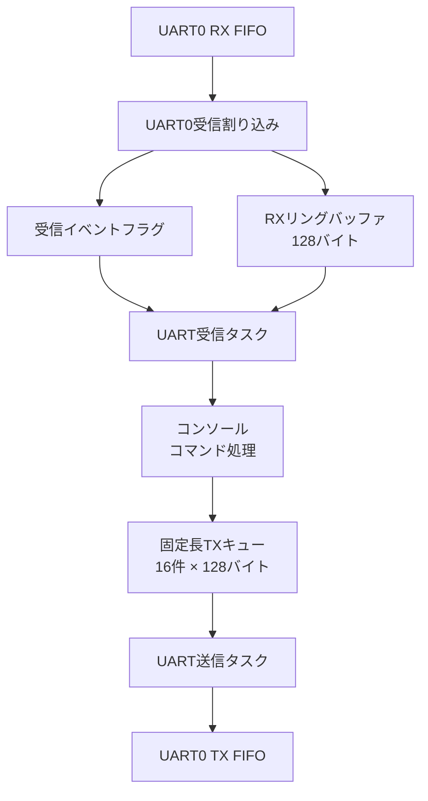

# TryKernel for Raspberry Pi Pico

Raspberry Pi Pico（RP2040）上で動作する、学習用の小規模RTOSプロジェクトです。

CQ出版社『Interface』2023年7月号の特集「ラズパイPicoで1500行 ゼロから作るOS」に掲載された、シングルコア版の**Try Kernel**を基にしています。

掲載版へGPIOドライバ、UARTコンソール、UART送受信バッファ、UART受信割り込み、I2Cドライバ、タスク間同期などを追加し、RTOSとマイコンの内部動作を学習するために拡張しています。

Pico SDKは使用せず、RP2040のレジスタを直接操作しています。

> [!NOTE]
> 本プロジェクトは、OSとマイコンの学習を目的としています。  
> 製品への組み込みを目的としたものではありません。

## プロジェクトの目的

このプロジェクトでは、次の仕組みを実際に実装・動作確認しながら理解することを目的としています。

- タスクの生成と実行
- 優先度ベースのスケジューリング
- コンテキスト切り替え
- READYキューとWAITキュー
- セマフォによる排他制御
- イベントフラグによるタスク同期
- UART受信割り込み
- 割り込み処理からタスク処理への受け渡し
- PendSVによる遅延ディスパッチ
- READYキュー更新後のスケジューリング動作
- UART送受信バッファ
- UARTコンソールとコマンド処理
- RP2040のI2Cコントローラのレジスタ直接操作
- I2Cバスに接続されたデバイスのアドレス検索

## 主な機能

### TryKernel

- Cortex-M0+向けシングルコアRTOS
- 優先度ベースのプリエンプティブ・スケジューリング
- PendSVによる遅延ディスパッチ
- タスク生成・起動・終了
- タスク遅延
- タスク起床待ち・起床
- セマフォ
- イベントフラグ
- タスク付帯同期
- 割り込み・例外コンテキストの判定
- SysTickによる10ms周期の時間管理
- 最大32タスク
- タスク優先度1～16
- 最大8セマフォ
- 最大8イベントフラグ

### 追加した周辺機能

- GPIO25のオンボードLED制御
- UART0のレジスタレベル・ドライバ
- UART0受信割り込み
- 128バイトのUART受信リングバッファ
- イベントフラグによるUART受信タスクの起床
- UART受信ソフトウェア・オーバーフロー検出
- UART RX FIFOハードウェア・オーバーラン検出
- 1行入力方式のUARTコンソール
- コマンドテーブル方式のコマンド処理
- 固定長UART送信キュー
- UART送信専用タスク
- セマフォによる送信キューの保護
- イベントフラグによる送信タスクの起床
- 軽量な`mini_printf()`
- I2C0のレジスタレベル・ドライバ
- GPIO4／GPIO5を使用したI2C通信
- I2Cデバイス検索コマンド
- ADT7410温度センサードライバ
- ADT7410温度取得コマンド

## UARTの構成



UARTの受信処理と送信処理は、それぞれ異なる方式で実装しています。

| 方向 | 方式 |
|---|---|
| UART受信 | 割り込み＋リングバッファ＋イベントフラグ |
| UART送信 | 送信キュー＋専用送信タスク＋ポーリング出力 |

## UART受信処理

UART受信処理は、次の流れで動作します。

```text
UART0で文字を受信
        ↓
UART0受信割り込み発生
        ↓
ハードウェアFIFOから受信データを読み出す
        ↓
ソフトウェア・リングバッファへ格納
        ↓
コールバック関数を呼び出す
        ↓
tk_set_flg()で受信イベントをセット
        ↓
UART受信タスクが待ち状態から起床
        ↓
リングバッファが空になるまでデータを処理
        ↓
再びイベント待ち状態へ移行
```

UART割り込みハンドラでは、コンソールのコマンド解析を行いません。

割り込みハンドラの役割は、次の処理に限定しています。

- UART RX FIFOからのデータ読み出し
- 受信リングバッファへの格納
- オーバーラン状態の確認
- 受信タスクへのイベント通知

文字列のエコーやコマンド解析は、UART受信タスク側で実行します。

### 受信通知コールバック

UARTドライバがイベントフラグIDを直接管理しないように、受信通知にはコールバック関数を使用しています。

```c
typedef void (*UART_RX_NOTIFY_FUNC)(void);

void uart_rx_set_notify(UART_RX_NOTIFY_FUNC notify);
```

UART割り込みハンドラは、1文字以上をリングバッファへ格納できた場合に、登録された通知関数を呼び出します。

```c
if ((received != FALSE) && (uart_rx_notify != NULL)) {
    uart_rx_notify();
}
```

受信タスク側のコールバック関数では、イベントフラグをセットします。

```c
static void uart_rx_notify_from_isr(void)
{
    if (uart_rx_flgid > 0) {
        (void)tk_set_flg(
            uart_rx_flgid,
            UART_RX_EVENT_DATA
        );
    }
}
```

### UART受信タスク

UART受信タスクは、イベントフラグを無期限で待ちます。

```c
err = tk_wai_flg(
    uart_rx_flgid,
    UART_RX_EVENT_DATA,
    TWF_ORW | TWF_BITCLR,
    &flgptn,
    TMO_FEVR
);
```

受信イベントが発生すると、リングバッファが空になるまでデータを取り出します。

```c
while (uart_rx_getc(&c)) {
    console_input_char(c);
}
```

従来の2ms周期ポーリングで使用していた、次の処理は削除しました。

```c
tk_dly_tsk(2);
```

受信データがない間、UART受信タスクはWAIT状態になります。

```text
state  = TS_WAIT
waifct = TWFCT_FLG
```

### 割り込みからのタスク起床

UART割り込み内で`tk_set_flg()`を実行すると、待っているUART受信タスクがREADY状態になります。

TryKernelの現在の実装では、`dispatch()`によってPendSVが保留されます。UART割り込み中に直接コンテキストを切り替えるのではなく、UART割り込みから復帰した後にタスク切り替えが実行されます。

## UART送信処理

通常の文字列出力では、次の関数を使用します。

```c
uart_tx_send("Hello Try Kernel\r\n");
```

書式付き出力には、次の関数を使用します。

```c
uart_tx_printf(
    "count=%u value=%x\r\n",
    count,
    value
);
```

送信要求は固定長キューへ登録されます。

イベントフラグによってUART送信タスクが起床し、UART送信タスクがキューから文字列を取り出してUART0へ出力します。

```text
各タスク
   ↓
uart_tx_send() / uart_tx_printf()
   ↓
固定長UART送信キュー
   ↓
イベントフラグ
   ↓
UART送信タスク
   ↓
UART0 TX FIFO
```

送信キューはセマフォで保護しています。

また、コンソールの入力エコーなどによる直接出力と、UART送信タスクによる出力が競合しないよう、実際のUART出力にも別のセマフォを使用しています。

### `mini_printf()`の対応書式

現在、次の書式に対応しています。

```text
%s  %c  %d  %u  %x  %%
```

浮動小数点数、桁数指定、ゼロ埋めなどには対応していません。

## UART設定と接続

| 項目 | 設定 |
|---|---|
| UART | UART0 |
| ボーレート | 115200bps |
| データ形式 | 8N1 |
| フロー制御 | なし |
| TX | GPIO0 |
| RX | GPIO1 |
| LED | GPIO25 |

USB-UART変換器またはRaspberry Pi Debug ProbeのUART端子を使用する場合は、次のように接続します。

| Raspberry Pi Pico | USB-UART側 |
|---|---|
| GPIO0（TX） | RX |
| GPIO1（RX） | TX |
| GND | GND |

信号レベルは3.3V TTLを使用してください。

## I2C設定と接続

I2C0を使用し、RP2040のレジスタを直接操作しています。

| 項目 | 設定 |
|---|---|
| I2Cコントローラ | I2C0 |
| SDA | GPIO4（物理ピン6） |
| SCL | GPIO5（物理ピン7） |
| 通信速度 | 100kHz |
| アドレス形式 | 7ビット |
| 転送方式 | ポーリング |

接続例は次のとおりです。

| Raspberry Pi Pico | I2Cデバイス |
|---|---|
| 3.3V | VCC |
| GND | GND |
| GPIO4 | SDA |
| GPIO5 | SCL |

GPIO4とGPIO5では内部プルアップを有効にしていますが、安定した通信には外部プルアップ抵抗を使用することを推奨します。市販のセンサーモジュールには、プルアップ抵抗が実装されている場合があります。

`i2cscan`コマンドは、予約アドレスを除く`0x08`から`0x77`までを走査します。各アドレスに対して1バイトのダミー読み出しを行い、ACKが返されたアドレスを表示します。

```text
I2C0初期化
    ↓
ターゲットアドレスを設定
    ↓
1バイト読み出し要求
    ↓
ACK／NACKを確認
    ↓
次のアドレスへ
```
書き込み専用など、ダミー読み出しに応答しないデバイスは検出できない場合があります。

### ADT7410温度取得

`temperature`コマンドは、I2Cアドレス`0x48`のADT7410から温度レジスタを読み出します。

ADT7410はデフォルトの13ビットモードで使用しています。温度分解能は`0.0625℃`です。温度データは16ビットの2の補数形式で格納されますが、13ビットモードでは下位3ビットが`TCRIT`、`THIGH`、`TLOW`の状態フラグになるため、温度変換時に除外しています。

浮動小数点演算は使用せず、温度をミリ℃単位の整数へ変換しています。変換結果は小数第3位まで表示します。

```text
温度レジスタのアドレス0x00を書き込み
    ↓
Repeated START
    ↓
温度データを2バイト読み出し
    ↓
下位3ビットの状態フラグを除外
    ↓
2の補数を符号付き整数へ変換
    ↓
ミリ℃単位へ変換して表示
```

## 必要な環境

Linux MintまたはUbuntu系Linuxを想定しています。

- Raspberry Pi Pico
- Raspberry Pi Debug ProbeなどのCMSIS-DAP対応デバッガ
- GNU Arm Embedded Toolchain
- GNU Make
- OpenOCD
- minicomなどのシリアル端末

Ubuntu／Linux Mintでは、必要なツールを次のようにインストールできます。

```bash
sudo apt update
sudo apt install gcc-arm-none-eabi binutils-arm-none-eabi make openocd minicom
```

## リポジトリの取得

```bash
git clone https://github.com/kazu025/trykernel-rp2040-console.git
cd trykernel-rp2040-console
```

## ビルド

リポジトリのルートディレクトリで実行します。

```bash
make clean
make
```

ビルドに成功すると、`build/`以下に次のファイルが生成されます。

| ファイル | 内容 |
|---|---|
| `tkv.elf` | デバッグ情報付き実行ファイル |
| `tkv.bin` | バイナリ形式 |
| `tkv.hex` | Intel HEX形式 |
| `tkv.lst` | ソース混在の逆アセンブル・リスト |
| `tkv.map` | リンカ・マップ |

このプロジェクトは、次のオプションを使用するフリースタンディング環境です。

```text
-ffreestanding
-nostdlib
-nostartfiles
-fno-builtin
```

標準Cライブラリは使用していません。

`uart_tx_init()`では構造体の各メンバを明示的に初期化し、コンパイラによって意図しない`memset()`呼び出しが生成され、リンクエラーになる問題を回避しています。

## 書き込み

PicoのSWD端子とCMSIS-DAP対応デバッガを接続して、次を実行します。

```bash
make flash
```

書き込み後にCPUを停止させる場合は、次を使用します。

```bash
make flash-halt
```

OpenOCDからCPUを停止する場合は、次を使用します。

```bash
make halt
```

## UARTコンソール

UARTが`/dev/ttyACM0`として認識された場合は、次のように接続します。

```bash
minicom -D /dev/ttyACM0 -b 115200
```

端末側を次のように設定します。

- 115200bps
- 8ビット
- パリティなし
- ストップビット1
- ハードウェア・フロー制御なし
- ソフトウェア・フロー制御なし

現在のコンソールは、CRをEnterとして処理します。端末の改行送信もCRに設定してください。

## コマンド一覧

| コマンド | 内容 |
|---|---|
| `help` / `h` | コマンド一覧を表示 |
| `status` | TryKernel、LED、UARTの状態を表示 |
| `echo <text>` | 引数をUARTへ出力 |
| `led on` | LEDを点灯 |
| `led off` | LEDを消灯 |
| `led blink` | LEDを点滅 |
| `print` | `mini_printf()`の書式テスト |
| `i2cscan` | I2Cバスに接続されたデバイスを検索 |
| `temperature` | ADT7410から温度を取得 |

## 動作例

```text
Start Try Kernel

uart tx task start
Hello Try Kernel

uart rx task start
> LED task start!!
help
commands:
   help -  show command list
   h -  show command list
   status -  show system status
   echo -  echo arguments
   led -  led on/off/blink
   print -  print test
   i2cscan -  scan I2C devices
   temperature -  read temperature from ADT7410 sensor
> status
TryKernel status: running
LED mode: OFF
UART TX queue: OK
UART TX overflow count: 0
UART RX overflow count: 0
UART RX HW overrun count: 0
UART RX IRQ count: 0
UART RX timeout IRQ count: 8
> led blink
led blink
> echo abcdef
abcdef
> print
test: abc Z -123 456 1a2b3c %
> i2cscan
Scanning I2C bus...
Found device at 0x48
I2C scan complete. Found 1 device(s).
> temperature
ADT7410 temperature: 25.250 C
> temperature
ADT7410 temperature: 25.313 C
```

上記の例では、I2Cアドレス`0x48`のADT7410を検出し、温度を取得しています。ADT7410の13ビットモードの分解能は`0.0625℃`であるため、表示値は約`0.063℃`単位で変化します。

起動時に次のように表示される場合があります。

```text
> LED task start!!
```

これは、UART受信タスクがプロンプトを表示した後に、LEDタスクの起動メッセージが送信キューへ登録されたためです。UART出力が文字単位で混在しているわけではありません。

## タスク構成

数字が小さいほど優先度が高くなります。

| タスク | 優先度 | 役割 |
|---|---:|---|
| UART RX | 4 | イベント待ち、リングバッファ読み出し、コンソール入力 |
| UART TX | 6 | 送信キューの取り出しとUART出力 |
| UART Log A | 8 | 送信競合テスト用ログ |
| UART Log B | 10 | 送信競合テスト用ログ |
| LED | 12 | LEDの点灯・消灯・点滅 |

ログタスクの出力は、`user/task_uartlog.c`の`ENABLE_UART_LOG_TEST`で有効または無効にできます。現在の初期値は無効です。

## ディレクトリ構成

```text
.
├── boot/       # boot2、リセットハンドラ、ベクタテーブル
├── drivers/    # GPIO、UARTドライバ、I2Cドライバ
├── include/    # TryKernel API、型、レジスタ、設定定義
├── kernel/     # スケジューラ、タスク管理、同期機能
├── linker/     # RP2040用リンカスクリプト
├── user/       # ユーザータスク、コンソール、UART送信機能
└── Makefile
```

## UART状態・エラー情報

`status`コマンドでは、UARTの割込み回数とエラー情報を確認できます。

| 表示 | 内容 |
| ---------------------------- | ----------------------------------------- |
| `UART TX overflow count`     | 送信キューへ登録できなかった回数            |
| `UART RX overflow count`     | 受信リングバッファへ格納できなかった回数     |
| `UART RX HW overrun count`   | UART RX FIFOのオーバーランを検出した回数     |
| `UART RX IRQ count`          | RX FIFOが受信しきい値に達した割込み回数      |
| `UART RX timeout IRQ count`  | 受信タイムアウト割込みが発生した回数          |

`UART RX HW overrun count`は、オーバーランを検出した回数です。失われた正確な文字数ではありません。

`UART RX IRQ count`と`UART RX timeout IRQ count`は、受信文字数ではなく割込みの発生回数です。1回の割込みで、RX FIFO内の複数文字を読み出す場合があります。

少量または間隔の空いた入力は主に受信タイムアウト割込みで処理され、連続入力ではRX FIFO割込みが発生します。どちらの場合も、割込みハンドラはRX FIFOを空になるまで読み出し、受信リングバッファへ格納します。

## 実装上の制約

- RP2040のコア0だけを使用するシングルコア構成です。
- UART受信リングバッファの配列サイズは128バイトです。
- UART送信キューは16件です。
- UART送信キューの1メッセージは、終端文字を含めて128バイトです。
- 送信文字列は最大127文字で切り詰められます。
- コンソールの改行入力は、現在CRのみを処理します。
- `mini_printf()`は機能を限定した独自実装です。
- TryKernel APIは学習に必要な範囲の部分実装です。
- T-Kernel仕様への完全準拠を目的としていません。
- 待ちを発生させるTryKernel APIは、割り込み・例外コンテキストから呼び出せません。
- 割り込みからの`tk_set_flg()`は、本プロジェクトのTryKernel実装を前提としています。
- I2C通信は現在ポーリング方式です。
- I2CはI2C0、GPIO4／GPIO5、100kHz固定です。
- `i2cscan`は7ビットアドレスだけに対応しています。
- 現在、I2Cバスのタスク間排他制御は実装していません。
- ADT7410はI2Cアドレス`0x48`、デフォルト13ビットモードで使用しています。
- `temperature`コマンドは浮動小数点演算を使用せず、ミリ℃単位の整数で温度を処理します。

## 原典からの変更について

本プロジェクトは、『Interface』2023年7月号に掲載されたRP2040向けシングルコア版TryKernelを基にしています。

学習および動作確認のため、掲載版に対して一部の修正と機能追加を行っています。

本リポジトリは、原著者またはCQ出版社による公式な修正版ではありません。

### TryKernel本体の修正

- `tk_wup_tsk()`のレディキュー添字を修正
- タスクAPIの一部に引数検査を追加
- セマフォAPIの一部に引数検査を追加
- イベントフラグAPIの一部に引数検査を追加
- UART割り込みに必要なNVICとUARTレジスタ定義を追加
- UART受信オーバーラン検出に必要なレジスタ定義を追加
- IPSRによる割り込み・例外コンテキスト判定を追加
- `tk_wai_flg()`、`tk_wai_sem()`、`tk_dly_tsk()`、`tk_slp_tsk()`にコンテキストチェックを追加
- 割り込み・例外コンテキストから待ち系APIを呼び出した場合は`E_CTX`を返すように変更
- `tk_set_flg()`で複数タスクを待ち解除した際、`scheduler()`を待ちタスクごとに呼ばず、待ち解除処理完了後に1回だけ実行するよう改善

### ユーザー機能・ドライバの追加

- GPIOドライバとLED制御タスク
- UART0ドライバ
- UART受信割り込み
- UART受信リングバッファ
- コールバックによるUART受信通知
- イベントフラグによるUART受信タスクの起床
- UART送信キューと専用送信タスク
- セマフォによるUART送信キューの排他制御
- イベントフラグによるUART送信タスクの起床
- UARTコンソールとコマンド処理
- UART受信ハードウェア・オーバーランの検出・表示
- 軽量な`mini_printf()`
- I2C0ドライバ
- GPIO4／GPIO5のI2C機能設定
- I2Cデバイス検索コマンド

## UART受信割り込みの実装段階

UART受信処理は、段階的に実装しています。

### 第一段階

UART受信をタスクによるポーリングから、UART0受信割り込みへ変更しました。

```text
UART受信割り込み
    ↓
受信リングバッファ
    ↓
UART受信タスクが周期的に確認
```

### 第二段階

UART受信タスクの周期確認を廃止し、イベントフラグによる起床方式へ変更しました。

```text
UART受信割り込み
    ↓
受信リングバッファ
    ↓
イベントフラグ
    ↓
UART受信タスク起床
```

これにより、受信データがない間の周期ポーリングが不要になりました。


### 第三段階

割り込みからTryKernel APIを安全に使用できるようにするため、Cortex-M0+のIPSR（Interrupt Program Status Register）を使用して、現在の実行コンテキストを判定する処理を追加しました。

```c
static inline UW get_ipsr(void)
{
    UW ipsr;

    __asm__ volatile("mrs %0, ipsr" : "=r"(ipsr));

    return ipsr;
}

static inline BOOL is_interrupt_context(void)
{
    return (get_ipsr() != 0U);
}
```

IPSRには、現在処理している例外番号が格納されます。

```text
IPSR = 0
    → 通常のThread mode

IPSR != 0
    → 例外・割り込みハンドラ実行中
```

RP2040のUART0はIRQ20であるため、UART0割り込み中のException Numberは次の値になります。

```text
16 + IRQ20 = 36 = 0x24
```

GDBを使用して実機で確認した結果、通常のタスク実行中とUART0割り込み中で次の値になりました。

| 停止位置                  |         xPSR |       IPSR | 実行状態        |
| --------------------- | -----------: | ---------: | ----------- |
| `task_uartrx()`       | `0x01000000` |        `0` | Thread mode |
| `uart0_irq_handler()` | `0x61000024` | `36（0x24）` | UART0 IRQ   |

割り込みハンドラにはタスクのようなTCBは存在しません。

そのため、割り込み中に待ちを発生させるAPIを呼び出すと、`cur_task`が指している割り込まれたタスクを誤ってWAIT状態へ移行させる可能性があります。

これを防ぐため、次の待ち系APIにコンテキストチェックを追加しました。

| API            | 処理        |
| -------------- | --------- |
| `tk_wai_flg()` | イベントフラグ待ち |
| `tk_wai_sem()` | セマフォ資源待ち  |
| `tk_dly_tsk()` | タスク遅延     |
| `tk_slp_tsk()` | タスク起床待ち   |

各APIの先頭で実行コンテキストを確認します。

```c
if (is_interrupt_context()) {
    return E_CTX;
}
```

割り込み・例外コンテキストからこれらのAPIが呼ばれた場合は、TCBやREADY／WAITキューを変更せず、`E_CTX (-25)`を返します。

動作確認としてUART0割り込みからテスト用に`tk_wai_flg()`を呼び出し、GDBで次の戻り値を確認しました。

```text
E_CTX = -25
```

一方、UART受信割り込みで使用している`tk_set_flg()`は、待ち状態のUART RXタスクをREADY状態へ移行する通知側のAPIです。

現在のUART受信処理では、引き続き割り込みハンドラから`tk_set_flg()`を使用しています。

```text
UART0 IRQ
    ↓
uart_rx_notify_from_isr()
    ↓
tk_set_flg()
    ↓
UART RX task
WAIT → READY
    ↓
PendSVを保留
    ↓
割り込み復帰後に必要に応じてタスク切り替え
```


### PendSVによる遅延ディスパッチのGDB確認

UART0割り込み内から`tk_set_flg()`を呼び出した場合に、`scheduler()`から`dispatch()`が呼ばれても、その場でUART RXタスクへ直接切り替わらず、UART0割り込み処理を最後まで実行した後にPendSVへ移行することをGDBで確認しました。

確認時はUART TXタスク実行中にUART0割り込みが発生しました。

```text
task_uarttx()
    ↓
UART0 IRQ
    ↓
uart0_irq_handler()
    ↓
uart_rx_notify_from_isr()
    ↓
tk_set_flg()
    ↓
scheduler()
```

`scheduler()`では、現在実行中のUART TXタスクと、イベントフラグにより起床したUART RXタスクを次のように確認できました。

```text
cur_task->itskpri  = 6   // UART TX task
sche_task->itskpri = 4   // UART RX task
```

UART RXタスクの方が高優先度であるため、`scheduler()`から`dispatch()`が呼び出されます。

本プロジェクトの`dispatch()`は直接コンテキストスイッチを行わず、SCBのICSRへ`ICSR_PENDSVSET`を書き込み、PendSVをpending状態にします。

```c
static inline void dispatch(void)
{
    out_w(SCB_ICSR, ICSR_PENDSVSET);
}
```

`dispatch()`実行直後にGDBでxPSRを確認すると、次の値でした。

```text
xPSR = 0x81000024
```

下位のException Numberは`0x24 = 36`であり、UART0 IRQ（`16 + IRQ20`）を実行中であることが分かります。

さらに`scheduler()`から`tk_set_flg()`へ戻った後も、

```text
xPSR = 0x81000024
```

となっており、UART0割り込みコンテキストのままでした。

続いて、

```text
tk_set_flg()
    ↓
uart_rx_notify_from_isr()
    ↓
uart0_irq_handler()
```

と処理を戻り、`uart0_irq_handler()`の最終行でも、

```text
xPSR = 0x61000024
```

となっていました。

このことから、PendSVを要求した後もUART0割り込み処理は最後まで実行されていることを確認できました。

UART0割り込み終了後に実行を継続すると、PendSVハンドラである`dispatch_entry()`へ入りました。

```text
Breakpoint, dispatch_entry()
```

このときのxPSRは、

```text
xPSR = 0x4100000e
```

であり、下位のException Numberは`0x0e = 14`、すなわちPendSVでした。

また、`dispatch_entry()`突入時は次の状態でした。

```text
cur_task->itskpri  = 6   // UART TX task
sche_task->itskpri = 4   // UART RX task
```

以上から、実際の処理順序は次のようになることを確認しました。

```text
UART0 IRQ
    ↓
tk_set_flg()
    ↓
UART RX task
WAIT → READY
    ↓
scheduler()
    ↓
sche_task = UART RX task
    ↓
dispatch()
    ↓
PendSVをpending
    ↓
scheduler()から復帰
    ↓
tk_set_flg()から復帰
    ↓
uart_rx_notify_from_isr()から復帰
    ↓
uart0_irq_handler()終了
    ↓
PendSV
    ↓
dispatch_entry()
    ↓
UART RX taskへコンテキスト切り替え
```

これにより、本プロジェクトではUART割り込みハンドラ内で直接コンテキストスイッチを行うのではなく、PendSVを使用して割り込み処理完了後にタスク切り替えを行う、遅延ディスパッチになっていることを実機で確認できました。

### UART受信タスク起床処理のGDB確認

UART0受信割り込みから`tk_set_flg()`が呼び出され、UART RXタスクがWAIT状態からREADY状態へ移行し、実行対象として選択されるまでをGDBで確認しました。

まず、`uart_rx_notify_from_isr()`にブレークポイントを設定し、UARTから1文字入力したところ、次の呼び出し経路を確認できました。

```text
uart0_irq_handler()
    ↓
uart_rx_notify_from_isr()
    ↓
tk_set_flg()
```

GDBのバックトレースでは、次のようになりました。

```text
#0  tk_set_flg()
#1  uart_rx_notify_from_isr()
#2  uart0_irq_handler()
#3  <signal handler called>
#4  disp_020()
```

`tk_set_flg()`内でイベントフラグ待ちのタスクを検索した結果、UART RXタスクのTCBは次の状態でした。

```text
state   = TS_WAIT
waifct  = TWFCT_FLG
waiobj  = 1
waiptn  = 1
wfmode  = 33
itskpri = 4
```

`itskpri = 4`は、本プロジェクトで設定しているUART RXタスクの優先度と一致します。

続いて`tk_set_flg()`を1行ずつ実行し、TCBの状態が次のように変化することを確認しました。

```text
state:
    TS_WAIT
      ↓
    TS_READY

waifct:
    TWFCT_FLG
      ↓
    TWFCT_NON
```

さらに、READYキューへ追加する直前は対象優先度のREADYキューが空でした。

```text
ready_queue[PRI_INDEX(tcb->itskpri)] = NULL
tcb = 0x20000338
```

`tqueue_add_entry()`実行後は、READYキューの先頭とUART RXタスクのTCBが同じアドレスになりました。

```text
ready_queue[PRI_INDEX(tcb->itskpri)] = 0x20000338
tcb                                  = 0x20000338
```

これにより、UART RXタスクがWAITキューから外され、READYキューへ登録されたことを確認できました。

続いて`scheduler()`をステップ実行したところ、READYキューを優先度の高い順に検索し、`i = 3`でUART RXタスクを見つけました。

UART RXタスクの優先度は4であり、READYキューは0始まりのインデックスを使用するため、優先度4は`ready_queue[3]`に対応します。

`scheduler()`実行後は、次の状態になりました。

```text
sche_task    = 0x20000338
cur_task     = NULL
disp_running = 1
```

この時点で`sche_task`にはUART RXタスクが選択されています。

一方、`disp_running = 1`であるため、

```c
if (sche_task != cur_task && !disp_running) {
    dispatch();
}
```

の条件は成立せず、この`scheduler()`呼び出しから新たに`dispatch()`は実行されませんでした。

今回の割り込みは、`dispatch.S`の`disp_020`で実行可能タスクを待っている途中に発生していました。

そのため、処理の流れは次のようになります。

```text
disp_020
    ↓
UART0 IRQ
    ↓
uart_rx_notify_from_isr()
    ↓
tk_set_flg()
    ↓
UART RX task
WAIT → READY
    ↓
ready_queue[3]へ登録
    ↓
scheduler()
    ↓
sche_task = UART RX task
    ↓
UART0 IRQから復帰
    ↓
既存のdispatcherがsche_taskを確認
    ↓
disp_030
    ↓
cur_task = sche_task
```

実際に`disp_030`へブレークポイントを設定したところ、実行直前は次の状態でした。

```text
sche_task    = 0x20000338
cur_task     = NULL
disp_running = 1
```

`disp_030`の次の命令を1命令だけ実行すると、

```asm
str r2, [r0]
```

によって`cur_task`が`sche_task`と同じUART RXタスクのTCBを指すようになりました。

```text
cur_task  = 0x20000338
sche_task = 0x20000338
```

以上から、今回の実機確認では次の一連の動作を確認できました。

```text
UART0受信割り込み
    ↓
tk_set_flg()
    ↓
UART RXタスクをWAITキューから削除
    ↓
TS_WAIT → TS_READY
    ↓
READYキューへ登録
    ↓
scheduler()がUART RXタスクをsche_taskに選択
    ↓
割り込み復帰
    ↓
dispatcherがUART RXタスクをcur_taskに設定
    ↓
UART RXタスクの実行へ移行
```

この確認により、UART受信割り込みからイベントフラグを経由してUART RXタスクを起床させる処理が、TCB、READYキュー、スケジューラ、ディスパッチャまで一連の流れとして動作していることを確認できました。

### 通常タスク実行中のプリエンプションをGDBで確認

前節では、`disp_020`で実行可能タスクを待っている途中にUART0割り込みが発生したケースを確認しました。

次に、通常のLEDタスク実行中にUART0割り込みを発生させ、高優先度のUART RXタスクがREADYになった結果、PendSVを経由してプリエンプティブにタスクが切り替わる流れをGDBで確認しました。

UART0割り込み発生時のバックトレースは次のようになりました。

```text
#0  uart_rx_notify_from_isr()
#1  uart0_irq_handler()
#2  <signal handler called>
#3  task_led1()
```

このとき、現在実行中のタスクはLEDタスクでした。

```text
cur_task->itskpri = 12
disp_running      = 0
```

一方、`tk_set_flg()`で見つかったUART RXタスクは次の状態でした。

```text
state   = TS_WAIT
waifct  = TWFCT_FLG
waiobj  = 1
itskpri = 4
```

したがって、UART0割り込み発生時には次の状態になっています。

```text
実行中タスク:
    LED task
    priority = 12

起床対象:
    UART RX task
    priority = 4
```

数字が小さいほど優先度が高いため、UART RXタスクの方が高優先度です。

`tk_set_flg()`によってUART RXタスクがREADY状態になり、`ready_queue[3]`へ登録された後、`scheduler()`を実行すると、次の状態になりました。

```text
i            = 3
sche_task    = 0x20000338   // UART RX task
cur_task     = 0x200002f4   // LED task
disp_running = 0
```

このため、

```c
if (sche_task != cur_task && !disp_running) {
    dispatch();
}
```

の条件が成立し、`dispatch()`が呼び出されました。

`dispatch()`ではSCBのICSRレジスタへ`ICSR_PENDSVSET`を書き込み、PendSVを保留状態にします。

```c
static inline void dispatch(void)
{
    out_w(SCB_ICSR, ICSR_PENDSVSET);
}
```

GDBでICSRを確認したところ、次の値になりました。

```text
ICSR = 0x1040e024
```

`PENDSVSET`はbit 28（`0x10000000`）であるため、PendSVがpendingになっていることを確認できました。

UART0割り込みから復帰すると、PendSVハンドラである`dispatch_entry()`へ入りました。

```text
Breakpoint, dispatch_entry()
```

`dispatch_entry()`突入時は次の状態でした。

```text
disp_running = 0
cur_task     = 0x200002f4   // LED task
sche_task    = 0x20000338   // UART RX task
```

また、`info registers`で確認したxPSRは次の値でした。

```text
xPSR = 0x0100000e
```

下位のException Numberは`0x0e = 14`であり、PendSV例外を実行中であることを確認できました。

#### 実行中タスクのコンテキスト保存

`dispatch_entry()`では最初に割り込みを禁止し、`disp_running`を1にします。

```text
PRIMASK      = 1
disp_running = 1
```

続いて、LEDタスクの`r4-r11`をソフトウェアでスタックへ保存します。

```asm
push    {r4-r7}
mov     r0, r8
mov     r1, r9
mov     r2, r10
mov     r3, r11
push    {r0-r3}
```

最初の`push {r4-r7}`では、SPが16バイト減少しました。

```text
0x20000f58
    ↓
0x20000f48
```

さらに`r8-r11`相当を保存する`push {r0-r3}`により、SPは次の値になりました。

```text
0x20000f48
    ↓
0x20000f38
```

保存完了後のSPは、現在実行中だったLEDタスクのTCBへ保存されます。

```asm
mov     r2, sp
str     r2, [r1]
```

GDBでLEDタスクのTCB先頭を確認したところ、保存されたSPと一致しました。

```text
LED task TCB = 0x200002f4
saved SP     = 0x20000f38
```

#### UART RXタスクへの切り替え

次に、`sche_task`からUART RXタスクのTCBを取得します。

```text
sche_task = 0x20000338
```

`disp_030`では、まずUART RXタスクを`cur_task`へ設定します。

```asm
str     r2, [r0]
```

実行後は次の状態になりました。

```text
cur_task  = 0x20000338
sche_task = 0x20000338
```

続いてUART RXタスクのTCBに保存されているSPを読み出し、CPUのSPへ設定します。

```asm
ldr     r0, [r2]
mov     sp, r0
```

GDBでは次の値を確認できました。

```text
UART RX task TCB saved SP = 0x200012e8
SP                         = 0x200012e8
```

これにより、スタックがLEDタスク側からUART RXタスク側へ切り替わったことを確認できました。

#### UART RXタスクのコンテキスト復元

UART RXタスク側では、保存時とは逆の順序で`r8-r11`、`r4-r7`を復元します。

```asm
pop     {r0-r3}
mov     r11, r3
mov     r10, r2
mov     r9, r1
mov     r8, r0
pop     {r4-r7}
```

最初の`pop {r0-r3}`では、SPが16バイト増加しました。

```text
0x200012e8
    ↓
0x200012f8
```

続く`pop {r4-r7}`でも16バイト増加し、次の値になりました。

```text
0x200012f8
    ↓
0x20001308
```

この時点で、TryKernelがソフトウェアで保存していた`r4-r11`の復元が完了しています。

最後に、

```asm
ldr     r0, =disp_running
mov     r1, #0
str     r1, [r0]
msr     primask, r1
bx      lr
```

によって、

```text
disp_running = 0
PRIMASK      = 0
```

へ戻した後、`bx lr`で例外復帰します。

`bx lr`実行直前は、

```text
lr   = 0xfffffff9
xPSR = 0x6100000e
```

であり、PendSV例外中でした。

`bx lr`実行後は、

```text
xPSR = 0x41000000
```

となり、Exception Numberが0になったことからThread modeへ復帰したことを確認しました。

バックトレースも次のようにUART RXタスク側へ戻りました。

```text
#0  set_primask()
#1  tk_wai_flg()
#2  task_uartrx()
```

また、`cur_task`はUART RXタスクのTCBを指していました。

```text
cur_task = 0x20000338
```

以上から、通常タスク実行中にUART0割り込みが発生した場合、次の一連のプリエンプティブなタスク切り替えが行われることを実機GDBで確認できました。

```text
LED task 実行中
priority = 12
    ↓
UART0 IRQ
    ↓
uart_rx_notify_from_isr()
    ↓
tk_set_flg()
    ↓
UART RX task
TS_WAIT → TS_READY
priority = 4
    ↓
ready_queue[3]へ登録
    ↓
scheduler()
    ↓
sche_task = UART RX task
    ↓
dispatch()
    ↓
ICSR.PENDSVSET = 1
    ↓
UART0 IRQから復帰
    ↓
PendSV
    ↓
dispatch_entry()
    ↓
LED taskのr4-r11を保存
    ↓
LED taskのSPをTCBへ保存
    ↓
cur_task = UART RX task
    ↓
UART RX taskのSPへ切り替え
    ↓
UART RX taskのr4-r11を復元
    ↓
disp_running = 0
PRIMASK = 0
    ↓
bx lr（EXC_RETURN）
    ↓
Thread modeへ復帰
    ↓
UART RX taskの実行を再開
```

この確認により、通常タスク実行中に高優先度のUART RXタスクが起床した場合、UART割り込みハンドラ内で直接コンテキストを切り替えるのではなく、`scheduler()`から`dispatch()`を呼び出してPendSVを保留し、UART割り込み復帰後にPendSVハンドラでコンテキストを保存・復元してタスクを切り替えることを確認できました。

前節の`disp_running = 1`のケースと合わせて、次の2つの経路を実機で確認できたことになります。

```text
disp_running = 1
    → 既存のdispatcherが動作中
    → scheduler()から新しいdispatch()は要求しない

disp_running = 0
    → 通常タスク実行中
    → 高優先度タスク起床時にdispatch()
    → PendSV経由でプリエンプション
```


## `tk_set_flg()`のスケジューラ呼び出し最適化

`tk_set_flg()`では、イベントフラグ待ちのタスクをWAITキューからREADYキューへ移動した後、`scheduler()`を実行します。

従来の実装では、`scheduler()`が待ちタスクを処理する`for`ループ内にありました。

```c
for (tcb = wait_queue; tcb != NULL; tcb = next) {
    ...
    tqueue_add_entry(
        &ready_queue[PRI_INDEX(tcb->itskpri)],
        tcb
    );

    scheduler();
    ...
}
```

この構造では、1回の`tk_set_flg()`で複数タスクの待ち条件が成立すると、待ち解除したタスクごとに`scheduler()`が実行されます。

この動作を確認するため、テスト用に2つのタスクを用意し、同じイベントフラグのBit0を`TWF_ORW`で待たせました。

```text
FlagTest A
priority = 7
    ┐
    ├─ 同じイベントフラグBit0を待つ
    │
FlagTest B
priority = 9
    ┘
```

`TWF_BITCLR`は指定せず、1つ目のタスクが待ち解除されてもイベントフラグがクリアされない条件としました。

`tk_set_flg()`を1回だけ実行したところ、変更前はGDBで次の2回の`scheduler()`呼び出しを確認しました。

```text
1回目:
tcb->itskpri = 7
tcb->state   = TS_READY

2回目:
tcb->itskpri = 9
tcb->state   = TS_READY
```

処理の流れは次のようになります。

```text
tk_set_flg() 1回
    ↓
FlagTest A
WAIT → READY
    ↓
scheduler() 1回目
    ↓
FlagTest B
WAIT → READY
    ↓
scheduler() 2回目
```

実際のディスパッチはPendSVによって遅延されますが、スケジューリング自体は各待ち解除時に実行されるため、同一サービスコール内でREADYキューの探索が重複していました。

そこで、READY状態になったタスクが存在したことを`need_schedule`で記録し、すべての待ちタスクを処理した後に`scheduler()`を1回だけ実行するよう変更しました。

```c
BOOL need_schedule = FALSE;

for (tcb = wait_queue; tcb != NULL; tcb = next) {
    ...
    tqueue_add_entry(
        &ready_queue[PRI_INDEX(tcb->itskpri)],
        tcb
    );

    need_schedule = TRUE;

    ...
}

if (need_schedule) {
    scheduler();
}
```

変更後に同じテストを実行したところ、`scheduler()`直前で2つのテストタスクがともにREADY状態になっていることを確認しました。

```text
FlagTest A = TS_READY
FlagTest B = TS_READY
```

その後`scheduler()`は1回だけ実行され、`continue`しても同じテスト用`tk_set_flg()`では再度ブレークしませんでした。

したがって、変更前後の動作は次のように整理できます。

```text
変更前:
FlagTest A READY
    ↓
scheduler()
    ↓
FlagTest B READY
    ↓
scheduler()

変更後:
FlagTest A READY
    ↓
FlagTest B READY
    ↓
scheduler()
```

この変更により、1回の`tk_set_flg()`で複数タスクを待ち解除する場合でも、READYキューの更新を完了してから`scheduler()`を1回だけ実行するようになりました。

なお、今回のテスト用`tk_set_flg()`は初期タスクの`usermain()`内から実行したため、`scheduler()`実行後は優先度1の初期タスクが引き続き`sche_task`として選択されました。

```text
cur_task->itskpri  = 1
sche_task->itskpri = 1
```

これは、スケジューラが今回READYになったタスクだけではなく、READYキュー全体から最も高優先度のタスクを選択しているためです。

## 今後の予定

- CR、LF、CRLFすべてへの対応
- UARTエラー情報と統計表示の拡充
- `tk_sig_sem()`、`tk_wup_tsk()`など、他の待ち解除側APIでもスケジューラ呼び出しタイミングを確認
- 割り込みコンテキストで複数サービスコールを実行した場合のスケジューリング動作を確認
- UART受信割り込み処理の改善
- GDBを使ったREADYキュー、WAITキュー、タスク状態、例外処理の確認
- TryKernel内部の理解を進めながら、必要な機能を段階的に追加
- I2Cバスのタスク間排他制御
- I2Cセンサータスクの追加

## 参考資料

- [Interface 2023年7月号「ラズパイPicoで1500行 ゼロから作るOS」](https://interface.cqpub.co.jp/magazine/202307/)
- [RP2040 Datasheet（Raspberry Pi公式）](https://pip.raspberrypi.com/documents/RP-008371-DS-rp2040-datasheet.pdf)
- [Raspberry Pi Pico SDK I2C bus scan example](https://github.com/raspberrypi/pico-examples/blob/master/i2c/bus_scan/bus_scan.c)
- [ADT7410 Data Sheet（Analog Devices公式）](https://www.analog.com/media/en/technical-documentation/data-sheets/ADT7410.pdf)

## ライセンスと原典について

本リポジトリは、『Interface』2023年7月号「ラズパイPicoで1500行 ゼロから作るOS」に掲載されたTry Kernelを基に、学習目的で一部を修正し、機能を追加したものです。

```text
Copyright (c) 2023 Yuichi Toyoyama
Copyright (c) 2026 kazu025
```

Try Kernel由来のコードはMIT Licenseに従います。

本リポジトリで追加・変更したコードについても、特に記載がない限りMIT Licenseで公開します。

著作権表示およびライセンスの詳細は、リポジトリ内の`LICENSE`と各ソースファイルのライセンス表示を確認してください。

`boot2.c`など、個別のライセンス表示があるファイルについては、そのファイルに記載されたライセンス条件が適用されます。

本リポジトリは学習目的の非公式な派生版であり、原著者およびCQ出版社による公式な修正版ではありません。